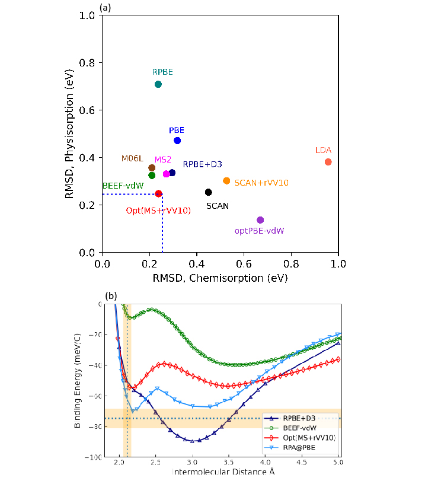
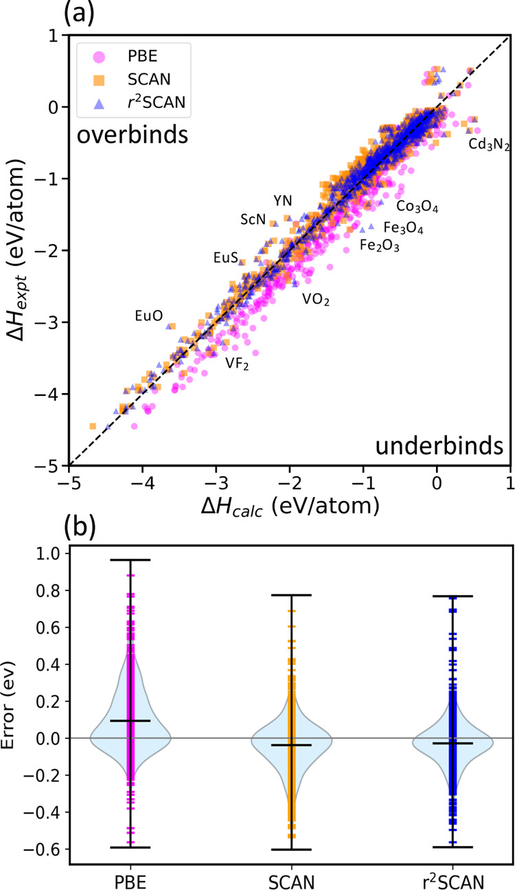

<!-- Google tag (gtag.js) -->

I am a **[Post-Doctoral Research Associate](https://coe.northeastern.edu/people/kothakonda-manish-kumar/)** at Northeastern University working with Qing Zhao at **[Computational Catalyst Design group](https://www.qzhao-neu.com/)** since Sept 2023. Previously, I was a Ph.D. student at Tulane University, New Orleans at **[Jianwei Sun's](https://www.matcomp.org/) Materials computation group** and Postdoctoral Research associate at the National Renewable Energy Lab & Colorado School of Mines.

As a **materials scientist**, I work closely with experimentalists, leveraging **computation and machine learning** to elucidate the thermodynamic and kinetic behavior of **catalytic active materials**. My research focuses on understanding and designing sustainable materials critically needed for heterogeneous catalysis and environmental applications.

Please see [Google Scholar](https://scholar.google.com/citations?user=chmsWhIAAAAJ&hl=en) for a full list of publications and my [CV](https://manishkothakonda.github.io/assets/files/MK_CV_1310.pdf). 

___

## Diversity, Equity, Inclusion, and Belonging
> I am committed to creating environments that are inclusive, equitable, and welcoming to everyone-whether personally or professionally. My approach is grounded in kindness, open-mindedness, and empathy.
>
> 1. Kindness: I believe in open, respectful communication. It’s important to me that different perspectives are welcomed, and I strive to treat others as I would want to be treated.
>
> 2. Open-mindedness: I focus on understanding rather than assuming. I’m aware of biases and am committed to actively reducing them. I also encourage those around me to uphold the same standards of inclusivity.
>
> 3. Empathy: I always keep in mind that we are working together to solve complex scientific and engineering challenges. I value patience and space for growth—both for myself and those I collaborate with.
>
These principles guide me in my work as a scientist and engineer, and I’m dedicated to fostering a positive and ethical environment for everyone.
___

## Research contributions
### II. Development of density functional for adsorption of molecules on surfaces
> In this study, we developed an efficient density functional approximation that accurately describes both chemical and physical adsorption processes by optimizing the semilocal component and incorporating a long-range van der Waals (vdW) correction. To achieve this, we fine-tuned the functional using two benchmark systems: CO adsorption on a Pt(111) surface to capture chemical interactions, and the Ar2 binding energy curve for vdW interactions. This approach successfully balances the accuracy of both short-range chemical bonding and long-range vdW forces, offering a reliable tool for modeling general molecular adsorption processes.
> 
> **Kothakonda, Manish**, Ruiqi Zhang, Jinliang Ning, James Furness, Abhirup Patra, Qing Zhao, Jianwei Sun, "Towards chemical accuracy for chemi- and physisorption with an efficient density functional" A [https://arxiv.org/pdf/2410.11248](https://arxiv.org/pdf/2410.11248)

### II. Thermodynamic stability of solids using r^2SCAN density functional
> In this study, we assess the r2SCAN functional for its accuracy and stability in predicting solid-state thermodynamic properties, including formation and decomposition enthalpies, equilibrium volumes, and band gaps of over 1,000 solids. We compare r2SCAN with SCAN, PBE, and dispersion-corrected variants (SCAN+rVV10 and r2SCAN+rVV10). r2SCAN maintains accuracy comparable to SCAN, often improving upon SCAN for intermetallic systems, while balancing numerical stability. Notably, r2SCAN+rVV10 offers slightly better volume predictions but marginally less accurate formation enthalpies. Overall, r2SCAN is recommended as a reliable, general-purpose meta-GGA for materials discovery.
>
> We evaluated the r2SCAN functional's accuracy and stability in predicting solid-state thermodynamic properties, showing it improves on SCAN and performs reliably for materials discovery.
> 
> **Kothakonda, Manish**, Aaron D. Kaplan, Eric B. Isaacs, Christopher J. Bartel, James W. Furness, Jinliang Ning, Chris Wolverton, John P. Perdew, and Jianwei Sun. "Testing the r2SCAN Density Functional for the Thermodynamic Stability of Solids with and without a van der Waals Correction." ACS Materials Au 3, no. 2 (2022): 102-111 [https://doi.org/10.1021/acsmaterialsau.2c00059](https://pubs.acs.org/doi/10.1021/acsmaterialsau.2c00059?ref=PDF)

